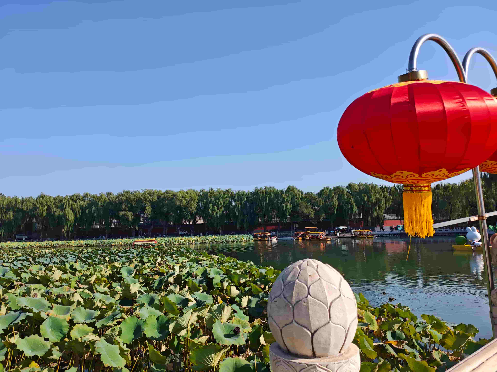

欢庆国庆！ 👋



## 主要目的

1. 记录国庆节期间游玩的各个景点
2. 具体时间不再描述，按相册照片先后顺序

### 具体景点

- 北海公园
- 景山公园
- 人民大会堂
- 鸟巢🚴‍♂️
- 联想总部🚴‍♂️
- 东郊民巷
- 王府井
- 香山公园🍁
- 圆明园

### 景点具体情况

1. 北海公园

   从学校坐地铁到北海北地铁站下车，全程大概40分钟。下了地铁就是经典的北京景点外观，红墙黄瓦。下了地铁沿着西安门大街向东步行约600m就可以到达北海的西安门。游园的顺序大概为从西南门进去，玩一圈从南门出。

   

   

   进入公园的第一眼还是比较震惊的，皇家园林就是不一样。因为文化水平有限，就去网上搜了一句诗。柳岸风轻翻画扇，徜徉美景醉弗还。《七律·北海秋颂》中的这句诗，形容了秋风轻拂柳岸，柳丝飘动如打开的画扇，游人沉醉于美景之中流连忘返。

   

   

   北海带给人最大的震撼其实就是其自然风光。自然风光非常优美。然后那个其他的这个我感觉关于艺术成分，就是比如说那些经典的历史建筑。这其实并不太多。九龙壁应该是比较突出的一个了。关于九龙壁的历史我就引用百度百科的介绍了。

   

   

   

   北海另外最出名的就是它的白塔了。永安寺白塔，又称北海白塔，位于[北京市](https://baike.baidu.com/item/北京市/126069?fromModule=lemma_inlink)[西城区](https://baike.baidu.com/item/西城区/10234?fromModule=lemma_inlink)文津街1号[北海公园](https://baike.baidu.com/item/北海公园/253388?fromModule=lemma_inlink)[永安寺](https://baike.baidu.com/item/永安寺/7380920?fromModule=lemma_inlink)内，始建于清顺治八年（1651年），是一座藏式喇嘛塔。永安寺白塔位于永安寺善因殿后山顶，藏式喇嘛塔，由塔基、塔身和塔顶三部分组成，高35.9米，塔身立于白石须弥座上，呈覆钵式，最大径14米，正面有壶门式眼光门，内刻藏文咒语。塔身上部有细长的相轮（又名十三天）和铜质华盖，最上为婆金火焰宝珠塔刹，整个塔身有306个通风孔。塔内有一高九丈的通天柱，柱顶放一金盒，内装舍利。塔下藏井内有旱船、佛龛、供桌及喇嘛经文衣钵和法物等 。永安寺白塔自建成以来一直是皇城北海的象征，也是中国佛塔中皇家佛塔的经典之作，同时也是藏传佛教入主中原帝都的象征，中国汉藏佛教在清代融合的开始。

   

   快出北海的时候，现在虽然是秋天，但是也体验了一把杨万里的感觉：接天莲叶无穷碧（主要是感觉）。

   

2. 景山公园

   对景山公园可以说是仰慕已久，对那个北京紫荆城的中轴线也是非常向往。

3. 
